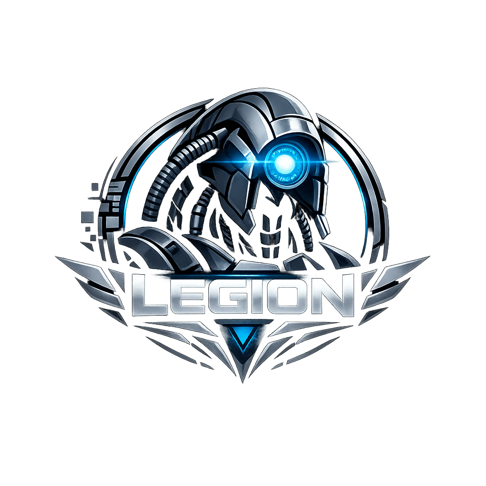
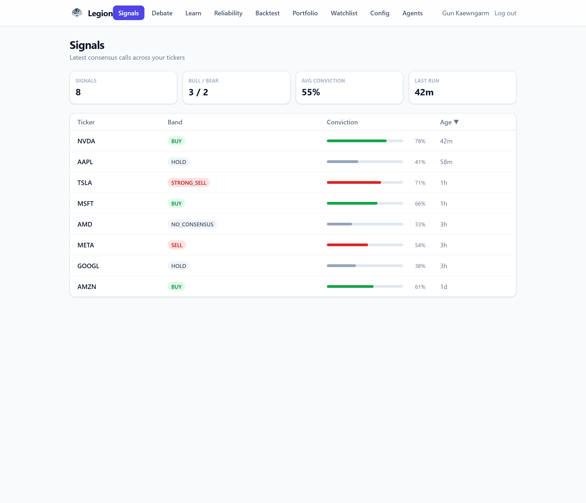
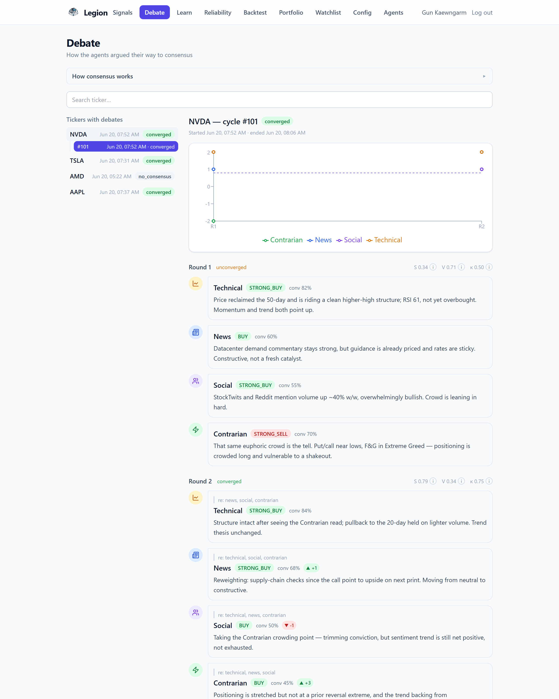

# Legion

<!-- BADGES:START -->
[](https://github.com/givewgun/legion/actions/workflows/ci.yml)


[](https://prettier.io)
<!-- BADGES:END -->

<!-- The badges above are auto-maintained by scripts/update-badges.mjs (CI
     rewrites the BADGES block on every push to main). Do not edit them by
     hand — your changes will be overwritten on the next push. -->

<div align="center">
  
</div>

**A leaderless, multi-agent stock-signal engine.** Independent expert agents each look at a
ticker, cast a structured vote, are forced to confront each other's dissent, and iterate
until a _deterministic_ consensus emerges — or they honestly agree to disagree. The result
is delivered as a trade plan to Telegram and a dashboard. It is **advisory only** — Legion
never places orders.

Inspired by the geth gestalt in _Mass Effect_ ("Legion"): no single mind decides. Many
narrow intelligences vote, and the agreement is the intelligence.

## Dashboard

**Signals** — the latest consensus call per ticker: band, conviction, and age. Click any row
to replay how the panel got there.



**Debate** — how the agents argued their way to consensus. Here round 1 splits: the Contrarian
fades a euphoric crowd with a `STRONG_SELL`. Forced to confront each other's dissent, the panel
re-votes and converges to **BUY** in round 2. Each round shows the aggregate stance `S`,
dispersion `V`, and directional quorum `κ`, with every agent's rationale.



## Documentation

| Doc                                                                              | What's in it                                                                                                                            |
| -------------------------------------------------------------------------------- | --------------------------------------------------------------------------------------------------------------------------------------- |
| 🧭 **[How it works](docs/HOW-IT-WORKS.md)**                                      | **Start here.** The whole machine in plain English (concept-first ELI5), then the exact algorithm — consensus → reliability → backtest. |
| 🏗️ [Architecture](docs/ARCHITECTURE.md)                                          | Runtime components, message flow, data model, Mermaid diagrams.                                                                         |
| 📐 [Design decisions](docs/adr/)                                                 | ADRs — the _why_ behind each choice.                                                                                                    |
| ▶️ [Running locally](docs/RUNNING.md)                                            | Full local-stack walkthrough: infra, migrate, seed, run, verify, troubleshoot.                                                          |
| 🚀 [Deployment](docs/DEPLOYMENT.md) · [Adding an agent](docs/adding-an-agent.md) | Production topology · how to drop in a new agent.                                                                                       |

This README is the operational overview — what it is, how the pieces run, and how to start it.
For any formula, threshold, or worked example, the [How it works](docs/HOW-IT-WORKS.md) doc is
the single source of truth.

---

## Why it exists

A single LLM asked "should I buy NVDA?" gives you one opinion with one set of blind spots.
Legion's bet is that a **diverse panel that argues** is more honest than any one model:

- **Holistic** — price action, breaking news/macro, social mood, and a dedicated
  contrarian are weighed _together_, not cherry-picked.
- **Leaderless / verifiable** — there is **no prime decider**. Every node receives the same
  votes over the message bus and runs the _same_ aggregation math, so the consensus is
  emergent and reproducible (state-machine-replication style), not handed down by an arbiter.
- **Self-tuning** — each agent carries a reliability weight that rises or falls with its
  track record. The gestalt learns which voices to trust.
- **≈ $0 runtime** — local LLM (Ollama) on an Oracle Always-Free VM, all data reused from
  the existing GunVest API, Telegram for delivery. The only real cost is development.

---

## How it works (one cycle)

```
 orchestrator ──kick──▶ legion.cycle.NVDA ──▶ ┌─ technical ─┐
 (cron, NOT a decider)                        ├─ news       ┤ each: gather data → ask LLM →
                                              ├─ social     ┤        publish a structured vote
                                              ├─ contrarian ┤
                                              └─ risk* ──────┘ (*non-voting: a constraint)
                                                     │
                          legion.vote.NVDA.<round>   ▼
                                              ┌───────────────┐
                                              │    emitter    │  collects votes → runs the
                                              │  (aggregation)│  shared consensus math
                                              └───────────────┘
                                                     │
                       converged?  ──no──▶ re-publish the cycle (round+1) with peers' dissent
                              │ yes
                              ▼
              persist (Postgres) → Telegram signal → legion.consensus.NVDA
```

Each agent is its **own process**, talking only over [NATS](https://nats.io) — no shared
memory, no coordinator, all interchangeable and independently restartable. The emitter
collects votes and runs the consensus math; if the panel hasn't converged it re-publishes the
cycle with peers' dissent and they re-vote, up to a round cap. On convergence the score
becomes a labelled trade plan; a panel that never agrees emits an honest `NO_CONSENSUS`.
Resolved signals feed a reliability loop that re-weights each agent for the next cycle.

> **The full algorithm** — the vote schema, the `S` / `V` / `κ` aggregation, convergence,
> the honesty guards, the risk constraint, the Brier-score reliability loop, and the
> backtest — is laid out concept-first then formula-first in
> **[docs/HOW-IT-WORKS.md](docs/HOW-IT-WORKS.md)**.

---

## Agent roster

| Agent                        | Prior `w_i` | Looks at                                  | Votes? | Why this weight                 |
| ---------------------------- | ----------- | ----------------------------------------- | ------ | ------------------------------- |
| **Technical** (+Quant)       | 1.0         | price action, trend, momentum, volatility | ✅     | baseline                        |
| **News / Catalyst** (+Macro) | 1.2         | headlines, earnings/guidance, rates, VIX  | ✅     | catalysts move price hard       |
| **Social Sentiment**         | 0.8         | StockTwits / Reddit mood & volume         | ✅     | informative but herd-prone      |
| **Contrarian**               | 0.9         | crowd positioning, VIX; fades extremes    | ✅     | a deliberate counterweight      |
| **Risk Manager**             | —           | volatility, downside, sizing              | ❌     | deterministic safety constraint |

Adding an agent is config + a `gather` function + a persona prompt — every voting agent
shares one runner ([docs/adding-an-agent.md](docs/adding-an-agent.md)). The contrarian pulls a
live crowd-positioning panel via `src/data/feeds/`: Fear & Greed + VIX (GunVest REST), put/call
(CNN `graphdata`), AAII (aaii.com scrape), NAAIM (YCharts scrape), short interest (Finnhub).
Each source is isolated and degrades to `null` on failure, so a dead upstream never blocks a vote.

---

## Status

| Phase                        | Deliverable                                                                              | State   |
| ---------------------------- | ---------------------------------------------------------------------------------------- | ------- |
| **0 Foundation**             | repo, Docker, NATS, `legion` schema, consensus + vote libs, LLM provider, GunVest client | ✅ done |
| **1 Single agent E2E**       | Technical agent → vote → emitter → Telegram, one ticker                                  | ✅ done |
| **2 Consensus**              | News / Social / Contrarian + Risk constraint, multi-round iteration, multi-ticker        | ✅ done |
| **3 Dashboard**              | debate viewer, ticker config, signal feed                                                | ✅ done |
| **4 Backtest + reliability** | forward paper-test, index compare, `ρ_i` loop                                            | ✅ done |
| **5 Summary + polish**       | 6h Telegram summary, provider-switch UI, docs                                            | ✅ done |

Phase plans live in [`docs/superpowers/plans/`](docs/superpowers/plans/); per-milestone
handover notes in [`docs/superpowers/handovers/`](docs/superpowers/handovers/).

---

## Quick start

> Full local-stack walkthrough (infra, migrate, seed, run every process, verify,
> troubleshoot): **[docs/RUNNING.md](docs/RUNNING.md)**.

**Prerequisites:** Node.js ≥ 18 · Docker (NATS + Ollama) · a running GunVest instance
(REST API + PostgreSQL).

```bash
cp .env.example .env       # fill in values (see Configuration)
npm install
docker compose up -d       # start NATS + Ollama
docker exec -it legion-ollama ollama pull qwen2.5:7b-instruct
npm run db:migrate         # create the legion schema in GunVest's Postgres
npm test                   # full suite, infra-free
```

### Run the gestalt

Seed at least one enabled ticker:

```sql
INSERT INTO legion.tickers (symbol, enabled) VALUES ('NVDA', true)
ON CONFLICT (symbol) DO UPDATE SET enabled = true;
```

Each role is its own process (NATS + Ollama + GunVest + Postgres must be up):

```bash
npm run emitter            # waits for 4 votes + the risk constraint per round
npm run agent:technical
npm run agent:news
npm run agent:social
npm run agent:contrarian   # real crowd-positioning feeds (F&G, VIX, put/call, AAII, NAAIM, short interest)
npm run risk               # non-voting deterministic constraint node
npm run scheduler -- --now # kicks every enabled ticker immediately
```

Or bring the whole topology up with Docker: `docker compose up -d`. A consensus signal (or
`NO_CONSENSUS`) lands in Telegram per ticker, and `legion.rounds` holds every round of the
debate for the dashboard.

### Background crons

```bash
npm run reliability -- --now   # resolve due signals → recompute ρ, calibration, correlations
npm run summary -- --now       # post the daily Telegram digest for the recent window
```

Both also run on a schedule (`LEGION_*_CRON`). The reliability cron is what makes the panel
self-tune; see [How it works §10–§12](docs/HOW-IT-WORKS.md#10-learning-who-to-trust).

### Run the dashboard

```bash
npm run api                          # REST API on :8088 (serves the legion schema)
cd web && npm install && npm run dev # dashboard on :5174, proxies /api → :8088
```

Tabs: **Signals** (latest calls), **Debate** (pick a ticker → cycle → rounds with `S`/`V`/`κ`
and per-agent votes), **Config** (tickers the scheduler monitors), **Agents** (per-agent
provider/model, or disable an agent — persisted in `legion.agent_config`, read per cycle).

---

## Configuration

Read by [`src/config/index.js`](src/config/index.js). Consensus thresholds and what each one
does in the algorithm are detailed in
[How it works §14](docs/HOW-IT-WORKS.md#14-constants--dials).

**Consensus**

| Var                    | Default  | Meaning                                        |
| ---------------------- | -------- | ---------------------------------------------- | --- | -------------- |
| `CONSENSUS_THETA_V`    | `0.5`    | max dispersion `V` allowed for convergence     |
| `CONSENSUS_QUORUM`     | `0.6667` | min directional quorum `κ` (2/3 supermajority) |
| `CONSENSUS_MAX_ROUNDS` | `3`      | round cap before `NO_CONSENSUS`                |
| `CONSENSUS_HOLD_BAND`  | `0.5`    | neutral half-width: `                          | S   | < this` ⇒ HOLD |

**Delivery / pipeline**

| Var                                                   | Meaning                                                                                                                                            |
| ----------------------------------------------------- | -------------------------------------------------------------------------------------------------------------------------------------------------- |
| `TELEGRAM_BOT_TOKEN`, `TELEGRAM_CHAT_ID`              | signal delivery (reuses GunVest's bot)                                                                                                             |
| `LEGION_EXPECTED_AGENTS`                              | votes the emitter waits for before evaluating (4)                                                                                                  |
| `LEGION_RISK_ENABLED`                                 | require the risk constraint before finalizing (`true` by default)                                                                                  |
| `LEGION_CRON` / `LEGION_CRON_TZ`                      | scheduler cadence (default `0 11,17 * * 1-5` in `America/New_York` — twice per US trading day; see [ADR 0029](docs/adr/0029-market-aware-cron.md)) |
| `LEGION_SUMMARY_CRON` / `LEGION_SUMMARY_WINDOW_HOURS` | digest schedule (`0 18 * * 1-5`, after the post-close sweep) / look-back (`24`)                                                                    |
| `FINNHUB_API_KEY`                                     | enables the Contrarian short-interest feed only; the other feeds are live without it (short interest returns `null` when unset)                    |

**Ollama** (app side — `OLLAMA_TIMEOUT_MS`=`300000`, `OLLAMA_MAX_CONCURRENT`=`1`; container
side — `OLLAMA_NUM_PARALLEL`=`1`, `OLLAMA_KEEP_ALIVE`=`30m` to keep the model resident for a
whole sweep while still unloading between cycles).

LLM provider is pluggable (`local` Ollama by default; `gemini` / `openai` selectable per agent)
via [`src/llm/provider.js`](src/llm/provider.js). Only `local` is implemented today — selecting
another provider makes that agent abstain until it's added.

---

## CI/CD & deployment

GitHub Actions ([`.github/workflows/ci.yml`](.github/workflows/ci.yml)) runs on every
push/PR to `main`: `verify` (lint + `db:migrate` + tests), `web` (build + tests), and a
`docker` image build. A `deploy` job to the Oracle Cloud VM is chained on the end but is
**manual** (`workflow_dispatch`) for now — one `if:` line flips it to auto.

The badges at the top of this README are **auto-maintained**: on every push to `main` the
`badges` job feeds the verify/web test counts and coverage into
[`scripts/update-badges.mjs`](scripts/update-badges.mjs), which rewrites the marked block
and commits the result (`[skip ci]`, so it never re-triggers itself). They can't go stale —
don't hand-edit them. Run the script locally to preview:
`COV_BACKEND=80 COV_WEB=64 TESTS_BACKEND=618 TESTS_WEB=70 node scripts/update-badges.mjs`.

Production runs on the shared gunvest VM via
[`docker-compose.prod.yml`](docker-compose.prod.yml): all containers are named `legion-*`,
join gunvest's network to reach its Postgres + REST API, and the dashboard is exposed
through the shared Cloudflare tunnel. Full guide: **[docs/DEPLOYMENT.md](docs/DEPLOYMENT.md)**.

---

## Repository layout

```
src/
  bus/          NATS subjects + JSON wrapper, in-memory bus double
  consensus/    vote schema, stance helpers, aggregation math (the core)
  agents/       per-agent gather / prompt / parse / runner
  emit/         signal builder, Telegram client, emitter (runs consensus)
  risk/         non-voting risk constraint
  reliability/  resolver + ρ/calibration/correlation recompute (the self-tuning loop)
  backtest/     deterministic indicator backtest
  db/           schema, client, repository, migrations
  llm/          pluggable provider (Ollama)
  data/         GunVest REST client + contrarian feeds
  api/          read API for the dashboard
  run/          process entrypoints (scheduler, agents, emitter, crons)
web/            React + Vite dashboard
docs/           HOW-IT-WORKS, ARCHITECTURE, ADRs, RUNNING, DEPLOYMENT
test/           mirrors src/, infra-free
```

**Architecture notes** — five agents = five processes; one Ollama container serves the local
model and agents queue serially, so a cycle is roughly `agents × rounds × per-call latency`
(~12–15 min/ticker on the A1 VM). All state lives in an isolated `legion` schema in GunVest's
Postgres, with every round persisted so the dashboard can replay the debate. All market data
comes via GunVest — Legion never re-implements fetching. Tests are infra-free: a fake `pg`
pool, a stubbed LLM, and an in-memory bus double drive the whole pipeline, so CI needs no
broker or DB. The full picture is in [docs/ARCHITECTURE.md](docs/ARCHITECTURE.md).

---

## Cost

Infra (Oracle A1 Always-Free), Postgres (shared), LLM (local, or Gemini free tier),
data (GunVest free APIs), Telegram — **all $0**. Runtime total ≈ **$0**. The only cost is
development tokens, bounded by phasing.
