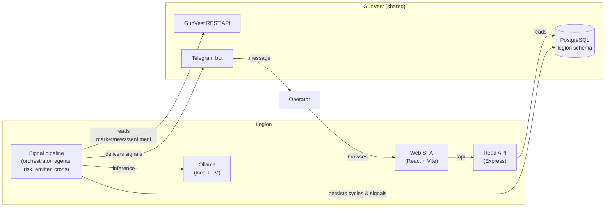
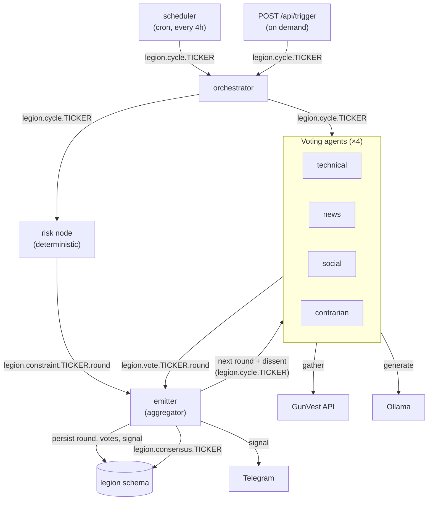
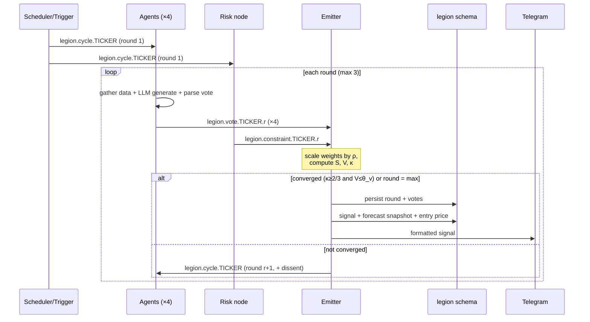
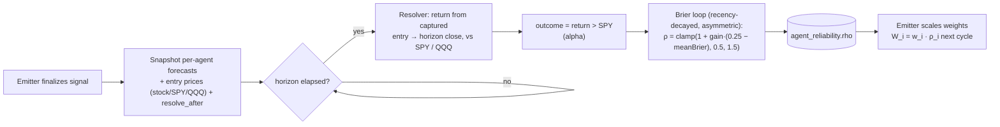
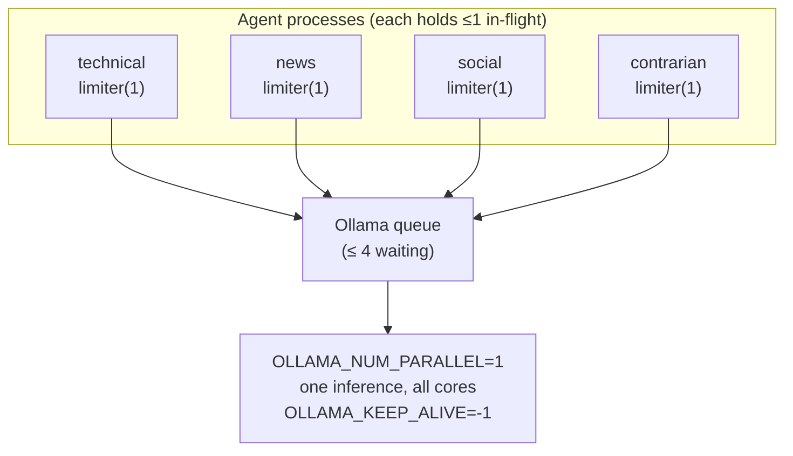
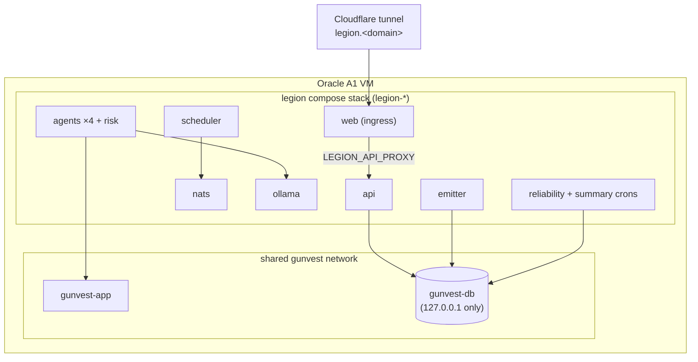
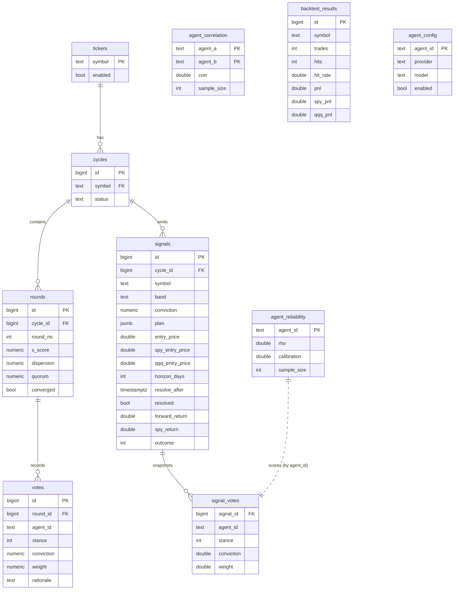

# Legion Architecture

Legion turns a panel of independent LLM "expert" agents into a single, reproducible trade
stance. There is **no prime decider**: every process sees the same votes over a message bus and
runs the *same* aggregation math, so the consensus is emergent and verifiable. This document
describes how the pieces fit together at runtime. The *why* behind each choice lives in the
[Architecture Decision Records](#architecture-decision-records).

All diagrams below are [Mermaid](https://mermaid.js.org/) and render directly on GitHub.

---

## 1. System context

Legion is a read-only consumer of GunVest (data, database, Telegram) and runs entirely on the
same Oracle A1 VM (ADR 0007, ADR 0004).

Legion never fetches market data itself; the single client seam is `src/data/gunvest.js`. Its
own state lives in an isolated `legion` schema inside GunVest's database.

---

## 2. Runtime components and message flow

Each box is a separate process (a Docker Compose service) communicating only over NATS subjects
(ADR 0002). The **emitter** drives the multi-round debate; the **scheduler** only kicks round 1.

Per round the emitter waits for `expectedAgents` votes (and the risk constraint, if enabled),
scales each vote's weight by reliability `ρ` and conviction by calibration, discounts redundant
agreement in the quorum (ADR 0015), and aggregates. If the round has not converged and the round
cap is not reached, it republishes the cycle for the next round **with the prior votes attached as
dissent**, so agents must confront disagreement before re-voting. A consensus reached only in a
later round must still retain independent round-1 backing or it is rejected as herding (ADR 0016).

---

## 3. Consensus round lifecycle

Up to `R_max = 3` rounds (ADR 0001). Convergence requires both a directional quorum
`κ ≥ 2/3` and dispersion `V ≤ θ_v` (0.5).

If no round converges by `R_max`, the signal band is `NO_CONSENSUS` (HOLD) — an honest "we
disagree" rather than a forced trade.

---

## 4. Reliability feedback loop

Agents self-tune from outcomes via a Brier score (ADR 0008), fed by the forward paper-test
(ADR 0009). The loop spans cycles and days, not a single evaluation.

`ρ` stays neutral at `1.0` until an agent has at least 5 resolved forecasts (over a trailing
window of 50), so a fresh deploy behaves like an unweighted panel until evidence accrues. Within
that window forecasts are **recency-weighted** (a ~20-forecast half-life) and the mapping is
**asymmetric** — a deteriorating forecaster loses trust faster than an improving one gains it,
because acting on a bad call costs capital (ADR 0017).

The same Brier loop also learns a **calibration** factor `cal` per agent — does an agent state
higher conviction when it turns out right than when it turns out wrong? `cal` scales the
conviction term (`c'_i = c_i · cal_i`), distinct from `ρ` which scales the prior `w_i`, so a
confident-but-uninformative voice cannot buy influence by always shouting. It is bounded to
`[0.5, 1.5]` and cold-start neutral on the same `MIN_RESOLVED`/`WINDOW` guardrails (ADR 0014).

---

## 5. Inference serialization

CPU-only Ollama on the A1 VM can run exactly one 7B inference at a time. A concurrent sweep
must not pile requests past their deadline (ADR 0005).

Each request carries an `AbortController` deadline and a custom undici dispatcher
(`headersTimeout: 0`) so only *our* timeout applies; transient transport errors retry with
backoff, but a timeout is treated as genuine saturation and is **not** retried — the agent
abstains instead.

---

## 6. Deployment topology

One Compose stack per VM, joined to GunVest's Docker network so it can reach GunVest's services
by name; the web container is the only public ingress, via GunVest's Cloudflare tunnel (ADR 0004).

GunVest's Postgres binds only to loopback, so the host gateway cannot reach it — joining the
shared network (not `host.docker.internal`) is what lets Legion talk to `gunvest-db`.

---

## 7. Data model (`legion` schema)

A single idempotent `src/db/schema.sql` owns these tables (ADR 0013).

`signal_votes` is a denormalized forecast snapshot taken at emit time; the resolver fills the
resolution columns on `signals` after the horizon, and the Brier loop reads the join to update
`agent_reliability`. `agent_config` is read per cycle to pick each agent's LLM provider.

---

## Architecture Decision Records

Each ADR is a short, dated record of one decision: its context, the choice, the alternatives
weighed, and the consequences. They live in [`docs/adr/`](adr/).

| ADR | Decision |
| --- | --- |
| [0001](adr/0001-consensus-protocol.md) | BFT-flavored leaderless consensus |
| [0002](adr/0002-message-bus.md) | NATS message bus with in-memory test double |
| [0003](adr/0003-inference-abstraction.md) | Pluggable LLM provider abstraction |
| [0004](adr/0004-deployment.md) | Single-VM Docker deployment on Oracle A1 |
| [0005](adr/0005-ollama-serial-inference.md) | Serialize Ollama inference under concurrent load |
| [0006](adr/0006-gunvest-client-resilience.md) | Resilient GunVest data client |
| [0007](adr/0007-gunvest-data-source.md) | GunVest as the sole data source and datastore |
| [0008](adr/0008-reliability-weighting.md) | Reliability-weighted consensus (Brier → ρ) |
| [0009](adr/0009-self-evaluation.md) | Forward paper-test + deterministic backtest |
| [0010](adr/0010-vote-contract-parsing.md) | Vote contract and tolerant parsing |
| [0011](adr/0011-risk-manager-constraint.md) | Risk Manager as a deterministic, non-voting constraint |
| [0012](adr/0012-dashboard-read-write-split.md) | Dashboard: thin read API + separate SPA + trigger |
| [0013](adr/0013-schema-management.md) | Single idempotent `schema.sql` (no migration tool) |
| [0014](adr/0014-conviction-calibration.md) | Conviction calibration (cal scales c_i, distinct from ρ) |
| [0015](adr/0015-correlated-agent-quorum.md) | Redundancy-discounted quorum (correlated agents count less) |
| [0016](adr/0016-anti-herding-guard.md) | Anti-herding guard (revision consensus needs independent backing) |
| [0017](adr/0017-reliability-recency-asymmetry.md) | Recency-decayed, asymmetric reliability (refines 0008) |
