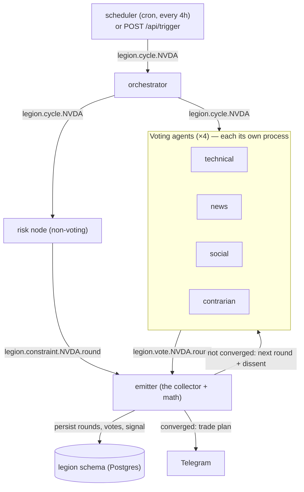
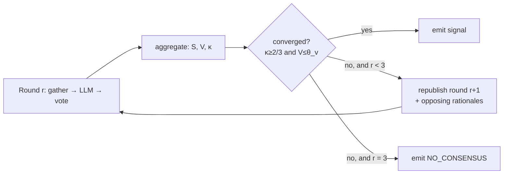
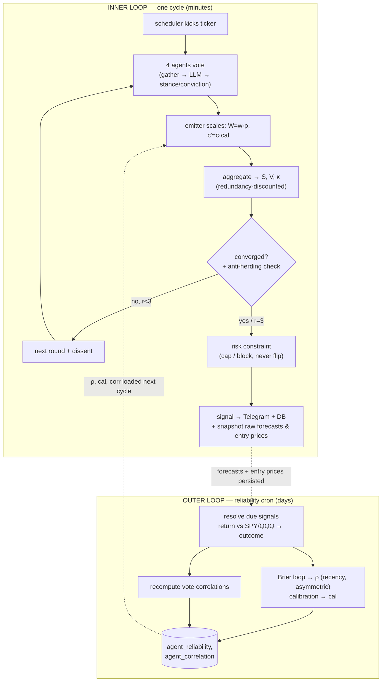

# How Legion Works

> **The one doc to read first.** The README is a tour and the [ADRs](adr/) are the
> "why we chose X over Y" trail — useful, but a lot to hold in your head at once. This page
> is the mental model: it explains the whole machine in plain English, *then* shows the exact
> math, layer by layer. Every section is **🧒 concept first, 🔢 algorithm second** — so you can
> stop at the concept, or keep reading down into the formulas.
>
> If you only read one thing, read [§1 The big idea](#1-the-big-idea).

**Contents**

1. [The big idea (ELI5)](#1-the-big-idea)
2. [The one cycle, start to finish](#2-the-one-cycle-start-to-finish)
3. [A vote — what each agent says](#3-a-vote)
4. [Consensus math — turning votes into a number](#4-consensus-math)
5. [Did they agree? (convergence)](#5-convergence)
6. [Arguing it out (iteration & dissent)](#6-iteration--dissent)
7. [Three guards that keep agreement honest](#7-three-honesty-guards)
8. [The Risk Manager (a brake, not a vote)](#8-the-risk-manager)
9. [From score to a trade signal](#9-from-score-to-signal)
10. [Learning who to trust (reliability & calibration)](#10-learning-who-to-trust)
11. [Did the call work? (the forward paper-test)](#11-did-the-call-work)
12. [The deterministic backtest](#12-the-deterministic-backtest)
13. [The whole loop in one picture](#13-the-whole-loop)
14. [Constants & dials cheat-sheet](#14-constants--dials)
15. [Where each piece lives in the code](#15-where-each-piece-lives)

---

## 1. The big idea

### 🧒 ELI5

Imagine you want to know whether to buy a stock. Instead of asking **one** know-it-all,
you put **four specialists** in a room:

- a **chart reader** (Technical) who only looks at price patterns,
- a **news hound** (News) who only cares about headlines, earnings, and the economy,
- a **mood watcher** (Social) who reads the crowd on Reddit/StockTwits,
- a **professional skeptic** (Contrarian) whose whole job is to argue the *other* side.

Each one privately writes down a vote: *"I think BUY, and I'm 80% sure."* Then they put the
votes on the table. If they mostly agree — great, that's the call. If they're split, they're
shown **each other's strongest objections** and asked to vote again. They get up to **3 rounds**
to either come together or honestly say *"we can't agree."*

Three things make this more than just averaging opinions:

1. **Nobody is the boss.** There's no head specialist who decides. Everyone sees the same
   votes and does the same arithmetic, so the answer is the *same* no matter who computes it.
   The agreement *is* the decision.
2. **Trust is earned.** Each specialist has a track record. One who's been right a lot gets a
   louder voice next time; one who's been wrong gets quieter. Legion keeps score automatically.
3. **It never pulls the trigger.** Legion only ever *advises* (a message to Telegram + a
   dashboard). A separate **safety officer** (Risk Manager) can tell it to "calm down" or "don't
   open a new long right now," but can never make it buy what the panel didn't want.

And because any voting system invites gaming, Legion bakes in **honesty guards** — it discounts
agents that merely echo each other, throws out a late "agreement" that is really everyone caving to
the loudest voice, and turns down forecasters who are confidently wrong. They are arguably the
cleverest part; if you only dip into one deep section, make it
[§7 Three honesty guards](#7-three-honesty-guards).

That's the entire product. Everything below is just *how* each of these ideas is made
precise.

### Why bother (vs. asking one model)?

One model gives you one opinion with one set of blind spots. A **diverse panel that is forced
to argue** surfaces the disagreement instead of hiding it — and when the panel *can't* agree,
that "we're split" is itself valuable information (it stops you trading a coin-flip).

### The name

From the geth "Legion" in *Mass Effect*: a single body running thousands of small programs that
**vote**, with no central mind. "Many narrow intelligences, and the consensus is the
intelligence."

---

## 2. The one cycle, start to finish

### 🧒 ELI5

A clock ticks every 4 hours (or you press a button). For each stock being watched it shouts
*"everybody look at NVDA!"* The four specialists each go gather their data, ask the local AI to
reason, and drop a vote in a shared mailbox. A collector called the **emitter** waits for all the
votes, does the agreement math, and either announces a result or sends everyone back for another
round. The clock is **not** a decider — it just says "go."

### The flow



Every box is a **separate process** that talks only over a message bus ([NATS](https://nats.io)).
No shared memory, no coordinator — any agent can crash and restart without anyone else caring.
That's what "leaderless" buys you in practice.

> **Key idea — state-machine replication.** Because every node sees the same votes and runs the
> *same* `aggregate.js`, the consensus is reproducible: you can hand the votes to any machine and
> get the identical answer. There is no privileged "decider" whose word you have to trust.

---

## 3. A vote

### 🧒 ELI5

A vote is just two numbers and a sentence: *how bullish/bearish* (a dial from strong-sell to
strong-buy), *how confident* (0–100%), and *why* (so peers can argue with it).

### The structure

Every agent `i`, per ticker, per round, emits:

| Field | Symbol | Range | Meaning |
|---|---|---|---|
| stance | `s_i` | `-2, -1, 0, +1, +2` | STRONG_SELL · SELL · HOLD · BUY · STRONG_BUY (an **ordinal** scale) |
| conviction | `c_i` | `0 … 1` | the agent's self-reported confidence |
| rationale | — | text | shown in the dashboard, and fed to peers as **dissent** next round |

Stance is deliberately a small integer scale (`src/consensus/stance.js`), so "how far apart two
agents are" is just subtraction.

---

## 4. Consensus math

This is the heart of the project. All of it lives in one heavily unit-tested module:
[`src/consensus/aggregate.js`](../src/consensus/aggregate.js). It is small on purpose.

### 🧒 ELI5

We boil the table of votes down to **three numbers**:

- **S — which way does the room lean?** A weighted average of everyone's stance. Positive =
  bullish, negative = bearish, near zero = "meh / hold."
- **V — how much do they disagree?** If everyone clusters around the same stance, `V` is small.
  If half scream BUY and half scream SELL, `V` is big.
- **κ (kappa) — how much of the room is on the winning side?** Out of all the "voting weight" in
  the room, what fraction sits on the same side as `S`?

A loud confident voice counts more than a meek unsure one. We do that by weighting each vote by
**(how much we trust the agent) × (how confident the agent is)**.

### The weight of a vote

Each agent's influence is `effective weight = W_i · c_i`, where:

```
W_i = w_i · ρ_i            (trust)        c_i = conviction       (confidence)
```

- `w_i` — **domain prior**, a fixed per-agent number (the roster: technical 1.0, news 1.2, social
  0.8, contrarian 0.9). Some lenses just matter more for moving price.
- `ρ_i` — **reliability**, a *learned* multiplier that starts at `1.0` and drifts up/down with the
  agent's track record (see [§10](#10-learning-who-to-trust)). Fresh install ⇒ all `ρ_i = 1` ⇒ the
  formulas below behave exactly as written.
- `c_i` is itself nudged by a learned **calibration** factor before aggregation (also §10), so an
  agent who cries "95% sure!" and is usually wrong gets its confidence quietly discounted.

### The three numbers

For one round's votes, writing `Σ` for "sum over all agents" and `W·c` for the effective weight:

```
Weighted stance        S = Σ(W_i · c_i · s_i) / Σ(W_i · c_i)              ∈ [−2, +2]
Weighted dispersion    V = Σ(W_i · c_i · (s_i − S)²) / Σ(W_i · c_i)       ≥ 0
Directional quorum     κ = Σ(W_i · c_i  on sign(S)'s side) / Σ(W_i · c_i) ∈ [0, 1]
```

- **`S`** is a weighted *mean* stance — where the panel leans.
- **`V`** is a weighted *variance* around that mean — the spread of opinion. Low `V` = near
  unanimous; high `V` = a real fight.
- **`κ`** is the share of weight that agrees with the lean. Two subtle, important rules:
  - **Hold band.** When the panel is near-neutral (`|S| < holdBand`, default `0.5`), agents who
    voted **HOLD** are *also* counted as agreeing. A flat consensus should credit the agents who
    actually sat flat — not pretend a wafer-thin lean is the whole story.
    ([code](../src/consensus/aggregate.js), `directionalQuorum`)
  - **Redundancy discount.** Agents that have *historically moved together* count as fewer
    independent confirmations — see [§7](#7-three-honesty-guards).

### Worked example (round 1 on NVDA, all `ρ_i = 1`)

| agent | `w_i` | stance `s_i` | conviction `c_i` | `W_i·c_i` |
|---|---|---|---|---|
| technical | 1.0 | +2 | 0.9 | 0.90 |
| news | 1.2 | +2 | 0.8 | 0.96 |
| social | 0.8 | +1 | 0.6 | 0.48 |
| contrarian | 0.9 | −1 | 0.5 | 0.45 |

```
Σ W·c = 2.79
S = (0.90·2 + 0.96·2 + 0.48·1 + 0.45·(−1)) / 2.79 = 3.75 / 2.79 ≈ +1.34   → leans BUY
V = (0.90·0.66² + 0.96·0.66² + 0.48·0.34² + 0.45·2.34²) / 2.79 ≈ 1.19
κ = (0.90 + 0.96 + 0.48) / 2.79 ≈ 0.84        # the three bulls
```

Hold that result — we use it in the next two sections.

---

## 5. Convergence

### 🧒 ELI5

"Did they agree enough to make a call?" Two boxes must **both** be ticked:

1. **Enough of the room is on one side** (a big supermajority), and
2. **They're not violently split** (the spread is small).

Why both? Because a bare majority that's *loudly* fighting isn't really consensus — it's a brawl
that one side happened to win. We refuse to call that a decision.

### The rule

A round converges **iff both** hold:

```
κ ≥ quorum     (default 2/3 — a Byzantine-style supermajority is on the same side)
V ≤ θ_v        (default 0.75 — dispersion is low enough)
```

([`evaluateRound`](../src/consensus/aggregate.js) → `converged = kappa >= quorum && V <= thetaV`.
θ_v was originally 0.5 (ADR 0001) and later tuned to 0.75 after live analysis.)

**Back to the example:** `κ = 0.84 ≥ 0.67` ✅ **but** `V = 1.19 > 0.75` ❌ → **not converged.** The
contrarian's confident dissent keeps the spread too high. The supermajority alone isn't enough;
the round does *not* emit. It goes another round.

### Why "2/3" — the Byzantine flavor

With `N` voting agents, the fault tolerance is `f = ⌊(N−1)/3⌋`. For the launch roster of `N = 4`,
`f = 1`: a **single** outlier agent can neither *force* a decision nor *block* one. Legion isn't
defending against lying machines (the agents are cooperative and co-located) — it just borrows
BFT's robustness shape: no leader, supermajority, single-outlier tolerance. (ADR 0001.)

One honest caveat: an **abstaining** agent (conviction 0) carries zero weight, so it drops out of
every sum — with one abstention the effective panel is `N = 3`, where `f = 0` and a single
dissenter *can* block. Rounds whose effective panel falls below `CONSENSUS_MIN_PANEL` (default 3)
are therefore tagged **`degraded`** on the signal plan and flagged in the Telegram message: the
call still emits, but the single-outlier guarantee no longer backs it.

### Does convergence require unanimity? No.

A common misread: that everyone must end up on the same side. They don't. A round can converge
**with a dissenter still voting the opposite direction** — as long as that dissenter is a minority
of the *weight* (so `κ ≥ 2/3` holds) **and** doesn't generate too much spread (so `V ≤ θ_v`). The
second part is the catch: an opposite-side vote's contribution to `V` is `W_i·c_i·(s_i − S)²`, so
it only stays small when the dissenter's **conviction (and weight) is low**.

| agent | `w_i` | stance `s_i` | conviction `c_i` | `W_i·c_i` |
|---|---|---|---|---|
| technical | 1.0 | +1 | 0.8 | 0.80 |
| news | 1.2 | +1 | 0.9 | 1.08 |
| social | 0.8 | +1 | 0.6 | 0.48 |
| **contrarian** | 0.9 | **−1** | **0.3** | **0.27** |

```
Σ W·c = 2.63
S = (0.80·1 + 1.08·1 + 0.48·1 + 0.27·(−1)) / 2.63 ≈ +0.79   → band BUY
V = (0.80·0.21² + 1.08·0.21² + 0.48·0.21² + 0.27·1.79²) / 2.63 ≈ 0.37
κ = (0.80 + 1.08 + 0.48) / 2.63 ≈ 0.90        # the three bulls
```

`κ = 0.90 ≥ 0.67` ✅ **and** `V = 0.37 ≤ 0.75` ✅ → **converged as BUY**, *while the contrarian is
still voting SELL.* At conviction 0.3 the dissenter is only ~10% of the weight: heard, but not
enough to break quorum or blow up dispersion.

The flip side is the lever that lets a dissenter **block**: give that same contrarian higher
conviction, or a stance of −2 instead of −1, and its `(s_i − S)²·W_i·c_i` term balloons `V` past
`θ_v` — back to iterating (exactly what happened in round 1 of the main example in §4, where the
contrarian's conviction-0.5 SELL pushed `V` to 1.19). So a dissenter's power to stop a call scales
with **how sure and how extreme** it is, not merely *that* it disagrees. That's the design intent:
a robust supermajority, not a forced unanimity — one committed skeptic should be heard, but not
hold a veto.

---

## 6. Iteration & dissent

### 🧒 ELI5

When the room doesn't agree, we don't average-and-shrug. We hand each specialist the
**strongest objections from the other side** and say *"knowing this, do you want to change your
vote?"* Maybe the chart reader didn't know about the bad earnings the news hound saw. People
update. We repeat this up to 3 times. If they *still* can't agree, we report "no consensus" — an
honest shrug beats a forced trade.

### The mechanics

When a round fails to converge and the round cap isn't reached, the emitter **re-publishes the
cycle** with `round + 1` and the prior round's votes attached. Each agent is shown the opposing
rationales and re-votes — it may hold its ground or move. ([`emitter.js`](../src/emit/emitter.js),
the `!isFinal` branch republishes `cycleSubject` with `priorVotes`.)

This repeats until convergence or `R_max` rounds (default **3**), at which point an unresolved
panel emits **`NO_CONSENSUS`** (conviction 0).



### Worked example, continued — round 2 converges

Recall round 1 failed on **dispersion, not quorum**: `κ = 0.84` already cleared the 2/3 bar, but
the contrarian's confident SELL kept `V = 1.19` above `θ_v = 0.5`. So the panel iterates. The
contrarian is now shown the bulls' strongest rationales (the catalyst the news agent flagged), and
— reluctantly, with low conviction — capitulates from SELL (−1) to a hedged BUY (+1, conviction
0.4). Everyone else holds. Round 2:

| agent | `w_i` | stance `s_i` | conviction `c_i` | `W_i·c_i` |
|---|---|---|---|---|
| technical | 1.0 | +2 | 0.9 | 0.90 |
| news | 1.2 | +2 | 0.8 | 0.96 |
| social | 0.8 | +1 | 0.6 | 0.48 |
| contrarian | 0.9 | **+1** | **0.4** | **0.36** |

```
Σ W·c = 2.70
S = (0.90·2 + 0.96·2 + 0.48·1 + 0.36·1) / 2.70 = 4.56 / 2.70 ≈ +1.69   → band STRONG_BUY
V = (0.90·0.31² + 0.96·0.31² + 0.48·0.69² + 0.36·0.69²) / 2.70 ≈ 0.21
κ = 2.70 / 2.70 = 1.00        # all four are now on the + side
```

`κ = 1.00 ≥ 0.67` ✅ **and** `V = 0.21 ≤ 0.75` ✅ → **converged.** With the lone dissenter gone the
spread collapses, and the call emits as **STRONG_BUY**, conviction `min(1.69/2, 1) ≈ 0.84`.

**Why this isn't herding (§7b):** the convergence appears only in round 2, so the anti-herding
guard checks the *round-1* independent backing for the `+` side — the three bulls, `(0.90 + 0.96 +
0.48) / 2.79 ≈ 0.84`, well above `priorQuorum` (default `0.33`). The bulls were already strong on
their own; the contrarian moved *toward* a pre-existing majority, not the other way around — so
this is genuine agreement, and the guard lets it through. (Had the bulls been weak in round 1 and
only piled on after hearing the loudest peer, the same guard would have blocked it.)

---

## 7. Three honesty guards

Plain weighted voting is gameable. Three small mechanisms keep "agreement" from being faked.
Each one is **off by default** (cold-start neutral) and only switches on once the system has
enough resolved history — so a fresh deploy behaves like the clean formulas in §4–§6.

### 7a. Redundancy discount — echoes aren't extra evidence (ADR 0015)

**🧒 ELI5:** If two specialists always parrot each other, their agreement isn't *two* opinions —
it's one opinion said twice. We discount it.

**🔢** In `κ`, the agreeing coalition's weight is scaled by **`N_eff / n`**, where `N_eff` is the
**effective number of independent voices** — the participation ratio `n² / Σᵢⱼ corr²ᵢⱼ` of the
coalition's correlation matrix (ADR 0020). All independent → no discount; `k` perfect echoes
collapse to **one** confirmation; partial correlation interpolates (three agents at pairwise 0.5
count as two voices). ([`effectiveVoices` / `directionalQuorum`](../src/consensus/aggregate.js);
correlations from [`correlation.js`](../src/consensus/correlation.js) — Pearson over each pair's
co-rated signals, defaulting to `0`/independent until ≥ 5 shared signals.)

### 7b. Anti-herding guard — caving ≠ agreeing (ADR 0016)

**🧒 ELI5:** If everyone agrees *only after* hearing the loudest voice, that might be real
persuasion — or it might be peer pressure. We require that a late agreement still has real
*independent* backing from round 1, or we throw it out.

**🔢** The emitter remembers round 1's votes (`firstVotesByCycle`). If a round **> 1** converges,
it checks the **independent backing** — the round-1 weighted fraction that already favored the
winning side — against `priorQuorum`. Below that, convergence is rejected and deliberation
continues. ([`independentBacking`](../src/consensus/aggregate.js) +
[`emitter.js`](../src/emit/emitter.js).)

### 7c. Reliability & calibration weighting — trust is earned (ADR 0008/0014/0017)

**🧒 ELI5:** Good forecasters get a louder voice; bad ones get quieter; and an agent that's
confident-but-usually-wrong has its confidence turned down. This is its own section because it's
where the learning lives → [§10](#10-learning-who-to-trust).

---

## 8. The Risk Manager

### 🧒 ELI5

A safety officer stands outside the voting room. He never votes on direction. But after the panel
decides, he can say *"markets are on fire today — cap how confident this call is"* or *"don't open
a brand-new long right now."* He can **shrink** a trade or **veto a new buy**, but he can never
turn a SELL into a BUY. The panel decides *what*; risk only limits *how much*.

### The rules (deterministic, no LLM — ADR 0011)

[`computeConstraint`](../src/risk/rules.js) reads VIX, the day's move, and the ticker's own
realized daily volatility, and returns a cap:

```
VIX ≥ 30  → cap conviction at 0.5     ("elevated VIX")
VIX ≥ 40  → block new longs            ("extreme VIX")
|daily move| ≥ 3σ of this name's daily vol → cap conviction at 0.4   ("outsized move", ADR 0022)
           (falls back to a flat 8% when vol data is unavailable)
```

The sigma normalization matters: a flat 8% is a five-sigma event in a utility (the brake
should have fired long before) and routine noise in a meme stock (the brake fired on a
normal day).

[`applyRiskConstraint`](../src/risk/apply.js) then, **only on a converged signal**:

- if `blockBuy` and band is BUY/STRONG_BUY → force **HOLD**, conviction 0 (`riskBlocked`);
- else if conviction exceeds the cap → clamp it down (`riskCapped`).

It returns a *new* signal and never flips the side. Leaderless purity preserved: risk constrains
the trade, it doesn't decide it.

---

## 9. From score to signal

### 🧒 ELI5

Turn the leaning number `S` back into a human label (BUY / STRONG_BUY / …) and a 0–100% conviction.

### The mapping

On convergence ([`stance.js`](../src/consensus/stance.js) + [`plan.js`](../src/emit/plan.js)):

```
band(S):   |S| < 0.5  → HOLD
           |S| ≥ 1.5  → STRONG_BUY / STRONG_SELL
           else       → BUY / SELL
conviction = min(|S| / 2, 1)        # the [−2,2] magnitude normalized to [0,1]
```

A non-converged final round emits **`NO_CONSENSUS`** (conviction 0). The signal carries the trade
plan, every agent's rationale, and `S / V / κ` so the dashboard can replay the whole debate.

Each round also records a fourth diagnostic, **agreement strength `A`** — the weighted mean
conviction of the agreeing side. `κ` and `V` cannot tell a timid unanimous panel (everyone at
conviction 0.3) from a confident one (everyone at 0.95); `A` can. It is **measured, not gated
on** — once enough signals resolve, the data can answer whether low-`A` consensus underperforms
before any gate is added (the same instrument-then-gate discipline as the other guards).

---

## 10. Learning who to trust

This is the feedback loop that makes Legion *self-tuning* rather than a fixed formula. It runs on a
cron, **across days**, not inside one cycle.

> **Build status —** implemented and running (the `legion-reliability` cron service), but
> **cold-start neutral**: ρ and calibration stay pinned at `1.0` until an agent has accrued
> `MIN_RESOLVED = 5` resolved forecasts. So on a fresh deploy the dials are wired and turning but
> *read neutral* — the panel is weighted exactly like the unweighted formulas in §4 until enough
> live signals resolve. Don't read this section as "ρ is reshaping weights today"; read it as "this
> is the mechanism, and it engages as history accrues."

### 🧒 ELI5

After each call, Legion writes down what every specialist predicted. Later — once enough time has
passed to know if the call worked — it grades them like a quiz:

- Were you **confident and right**? Score goes up, your voice gets louder.
- Were you **confident and wrong**? Score goes down faster (a confident wrong call is the
  expensive one).
- It also checks: **is your confidence meaningful?** Do you say "90%" when you turn out right and
  "55%" when you turn out wrong? If yes, your confidence is trusted more. If you shout "95%!" on
  everything, your confidence is ignored.

Two separate dials come out of this: **ρ (reliability)** scales *how much we trust you*, and
**cal (calibration)** scales *how much we believe your confidence number*.

### The two dials

Both live in [`src/consensus/reliability.js`](../src/consensus/reliability.js) and are recomputed by
[`recomputeReliability`](../src/reliability/update.js).

**ρ — reliability, from the Brier score.** Each resolved forecast is turned into a probability
`p = clamp(0.5 + s·c/4, 0, 1)` and scored with the **Brier score** `(p − outcome)²` against a
**graded outcome** (ADR 0018): `g = 0.5 + 0.5·tanh(alpha / 0.05)` where `alpha` is the excess
return vs SPY. Beating SPY by 20% and by 1bp are no longer the same outcome — a big confident
win scores better than a thin one, and a large confident miss costs more than a rounding-error
miss. (Rows resolved before returns were captured fall back to the binary outcome.)

The agent's decay-weighted mean Brier maps to ρ via the **skill score** against an
uninformative `p = 0.5` forecaster scored over the *same* outcomes (so neutrality is exact by
construction; with binary outcomes this reduces to the old `0.25 − meanBrier` formula):

```
edge = 0.25 · (1 − meanBrier / baselineBrier)
ρ    = clamp( 1 + gain · edge,  0.5, 1.5 )
        gain = 2  if better than the baseline (edge ≥ 0)   ← trust earned slowly
        gain = 4  if worse than the baseline (edge < 0)    ← trust lost twice as fast
```

The **asymmetry** (lose twice as fast as you gain) is deliberate: acting on a bad call costs real
capital (ADR 0017). ρ is clamped to `[0.5, 1.5]` and scales the prior: `W_i = w_i · ρ_i`.

**cal — calibration.** Among an agent's *directional* forecasts, compute the discrimination
`d = mean(conviction | it was right) − mean(conviction | it was wrong) ∈ [−1, 1]`, then
`cal = clamp(1 + d, 0.5, 1.5)`. Positive `d` (confident when right) → boosted; `d ≈ 0`
(confidence carries no signal) → neutral; negative → cut. `cal` scales the *conviction* term
`c'_i = c_i · cal_i` — separate from ρ, so a loud-but-uninformative voice can't buy influence by
always shouting (ADR 0014).

### Cold start, recency & shrinkage

- **Cold start:** both dials sit at the neutral `1.0` until an agent has at least `MIN_RESOLVED = 5`
  resolved forecasts. So a fresh deploy behaves exactly like the unweighted formulas in §4.
- **Window:** only the most recent `WINDOW = 50` resolved forecasts count.
- **Recency decay:** within that window, forecasts are weighted by a `HALF_LIFE = 20` exponential
  decay (a forecast 20 slots older counts half as much), so the panel can track a regime shift
  instead of being anchored to stale evidence (ADR 0017).
- **Shrinkage (ADR 0019):** every learned edge is scaled by `ess/(ess + 10)` — `ess` being the
  effective sample size of the decayed window — before it moves a dial. A 5-signal hot streak
  lands near 1.19, not the 1.5 cap; the extremes are earned by a *consistent* record, not a week.
- **Combined cap (ADR 0019):** the product `ρ·cal` is bounded to `[0.4, 2.0]` (by trimming
  calibration, never ρ) so the two dials can't compound one streaky agent into panel dominance.
- **Information check (ADR 0021):** a near-constant voter (zero stance variance — a stuck model
  or flatlined feed) is invisible to Brier and correlation alike, yet votes at full weight. Its
  recent stance variance maps to an `info` factor ∈ [0.25, 1] that multiplies its conviction
  alongside calibration, until its stances move again.
- **Regime conditioning (ADR 0023):** each signal is stamped with the market regime it fired in
  (`calm`/`stressed`, from VIX), and the learner grades each agent **per regime** alongside the
  unconditional dials. At cycle time the emitter overlays the current regime's dials where a
  deep-enough bucket exists — so the Contrarian can be trusted more at crowded extremes and less
  mid-range, instead of carrying one averaged number everywhere. Unknown regime ⇒ unconditional
  dials, bit-for-bit.

### Where the discounts plug back in

The emitter loads ρ, cal, and the correlation map **once per cycle** and applies them before the
math: `scaleWeights` (ρ → weights) then `scaleConviction` (cal → conviction), then `evaluateRound`
with the `corr` discount. Crucially, the **forecast snapshot it persists keeps RAW conviction** —
the learner must grade what the agent actually claimed, or you'd get a feedback loop.
([`emitter.js`](../src/emit/emitter.js) lines around `scaleWeights`/`scaleConviction`.)

---

## 11. Did the call work?

> **Build status —** implemented and running on the same reliability cron, but it can only grade
> signals that have **reached their fixed horizon**. Early in a deploy nothing has resolved yet, so
> the dials in §10 stay neutral until the first horizons elapse and outcomes start landing.

### 🧒 ELI5

To grade the panel we need to know if a call was *good*. "Good" here doesn't mean "the stock went
up" — it means **"did it beat the market?"** A BUY that rose 1% while the S&P rose 3% was a *bad*
relative call. So when a signal fires, Legion snapshots the entry price of the stock *and* of SPY
and QQQ at that same instant, waits the fixed horizon, then compares.

### The forward paper-test (ADR 0009)

At emit time the emitter captures `entry_price`, `spy_entry_price`, `qqq_entry_price` in the same
instant and sets `resolve_after = now + horizonDays`. Later,
[`resolveSignals`](../src/reliability/resolver.js) processes every due signal:

```
forwardReturn = (stock close at horizon − entry_price) / entry_price
spyReturn     = (SPY  close at horizon − spy_entry_price) / spy_entry_price
outcome       = 1 if forwardReturn > spyReturn  else 0       # did it beat SPY? (alpha)
```

Measuring all legs from a **shared "entered at signal time" base**, pinned to the fixed horizon
(`resolve_after`, *not* the cron's fire time), keeps two signals with the same horizon comparable —
so their Brier scores mean the same thing. Signals from before benchmark capture fall back to a
consistent close-to-close window. That `outcome` is exactly what feeds the Brier loop in §10.

> **QQQ is display-only.** The QQQ entry price and return are captured alongside SPY and stored,
> but **only SPY scores `outcome`** — one benchmark keeps every Brier score comparable (ADR 0008).
> QQQ exists for the dashboard's context, not for learning.

### The daily cron, in order

[`runReliabilityOnce`](../src/run/reliability.js) does, every run:

1. **resolve** every due signal → realized returns + `outcome` (§11),
2. **recompute reliability** ρ and calibration cal from each agent's resolved forecasts (§10),
3. **recompute correlations** for the quorum redundancy discount (§7a).

So the chain is: a signal fires → its forecasts are snapshotted → the horizon elapses → the
resolver grades it vs SPY → the Brier loop nudges ρ and cal → the *next* cycle's votes are weighted
by the updated trust. The gestalt literally learns which voices to believe.

---

## 12. The deterministic backtest

> **Build status —** runnable today as an on-demand tool (`npm run backtest`). It is a deterministic
> yardstick, **not** part of the live signal path — no LLM, no effect on what the panel emits.

### 🧒 ELI5

The forward paper-test is honest but slow — you have to wait for the future to happen. To get a
*fast, repeatable* sanity check we also run a plain, no-AI strategy over historical prices: simple
chart rules only. No LLM, so it's cheap and gives the identical answer every time. It's a
yardstick, not the product.

### The mechanics

[`runBacktest`](../src/backtest/deterministic.js) walks history candle by candle, computes plain
indicators (SMA20/50, RSI, MACD via [`indicators.js`](../src/backtest/indicators.js)), and turns
them into a stance with [`quantStance`](../src/backtest/indicators.js):

```
trend  = sign(SMA20 − SMA50)                 # no trend → HOLD, skip the trade
score  = trend·2 if MACD confirms the trend, else trend·1
RSI extreme against an over-extended ±2 reading de-escalates it to ±1 (never flips the side)
```

For every non-flat day it opens a position, exits `horizon` candles later, and tallies hit-rate and
P&L **vs SPY/QQQ** (direction-adjusted). The result lands in `backtest_results`. This is the same
deterministic logic the Technical agent leans on — reproducible because there's no model in the
loop (ADR 0009).

---

## 13. The whole loop

Putting §2–§12 together — the fast inner loop (one cycle, minutes) and the slow outer loop
(reliability, days):



The dotted lines are the two couplings that make it a *system* rather than a one-shot vote: signals
feed the grader, and the grader's verdicts feed the next vote's weights.

---

## 14. Constants & dials

The knobs you're most likely to touch. Consensus thresholds are env vars
([`src/config/index.js`](../src/config/index.js)); the learning constants are module-level in
[`reliability.js`](../src/consensus/reliability.js).

| Dial | Default | What it does | Where |
|---|---|---|---|
| `CONSENSUS_QUORUM` | `0.6667` | min `κ` to converge (2/3 supermajority) | env |
| `CONSENSUS_THETA_V` | `0.75` | max dispersion `V` to converge | env |
| `CONSENSUS_HOLD_BAND` | `0.5` | `|S| < this` ⇒ HOLD (and HOLD voters count in κ) | env |
| `CONSENSUS_MAX_ROUNDS` | `3` | round cap before `NO_CONSENSUS` | env |
| `CONSENSUS_MIN_PANEL` | `3` | effective-panel floor; below it the round is tagged `degraded` | env |
| `LEGION_EXPECTED_AGENTS` | `4` | votes the emitter waits for per round | env |
| `LEGION_RISK_ENABLED` | `true` | require the risk constraint before finalizing | env |
| `MIN_RESOLVED` | `5` | resolved forecasts before ρ/cal leave neutral | code |
| `WINDOW` | `50` | trailing resolved forecasts considered | code |
| `HALF_LIFE` | `20` | recency half-life (in forecasts) | code |
| ρ band / gains | `[0.5, 1.5]`, up `2` / down `4` | reliability clamp + asymmetric slopes | code |
| `cal` band | `[0.5, 1.5]` | calibration clamp | code |
| `LEGION_CRON` | `0 */4 * * *` | how often a cycle kicks (every 4h) | env |

---

## 15. Where each piece lives

| Concept | File |
|---|---|
| Vote scale, side, band mapping | [`src/consensus/stance.js`](../src/consensus/stance.js) |
| S / V / κ, convergence, anti-herding backing | [`src/consensus/aggregate.js`](../src/consensus/aggregate.js) |
| ρ (Brier), calibration, weight/conviction scaling | [`src/consensus/reliability.js`](../src/consensus/reliability.js) |
| Pairwise vote correlation (redundancy discount) | [`src/consensus/correlation.js`](../src/consensus/correlation.js) |
| Collector: rounds, dissent, herding guard, snapshot | [`src/emit/emitter.js`](../src/emit/emitter.js) |
| Score → signal label & conviction | [`src/emit/plan.js`](../src/emit/plan.js) |
| Risk rules + application | [`src/risk/rules.js`](../src/risk/rules.js), [`src/risk/apply.js`](../src/risk/apply.js) |
| Forward paper-test resolver | [`src/reliability/resolver.js`](../src/reliability/resolver.js) |
| ρ/cal recompute + correlation recompute | [`src/reliability/update.js`](../src/reliability/update.js), [`src/reliability/correlations.js`](../src/reliability/correlations.js) |
| Reliability cron entrypoint | [`src/run/reliability.js`](../src/run/reliability.js) |
| Deterministic backtest | [`src/backtest/deterministic.js`](../src/backtest/deterministic.js), [`src/backtest/indicators.js`](../src/backtest/indicators.js) |

---

### Going deeper

This doc is the map. For the *why* behind each decision (and the alternatives weighed), the
[ADRs](adr/) are the trail — most relevant here: **0001** (consensus protocol), **0008/0017**
(reliability), **0014** (calibration), **0015** (correlated quorum), **0016** (anti-herding),
**0011** (risk constraint), **0009** (self-evaluation). Architecture diagrams and the data model
live in [`ARCHITECTURE.md`](ARCHITECTURE.md).
